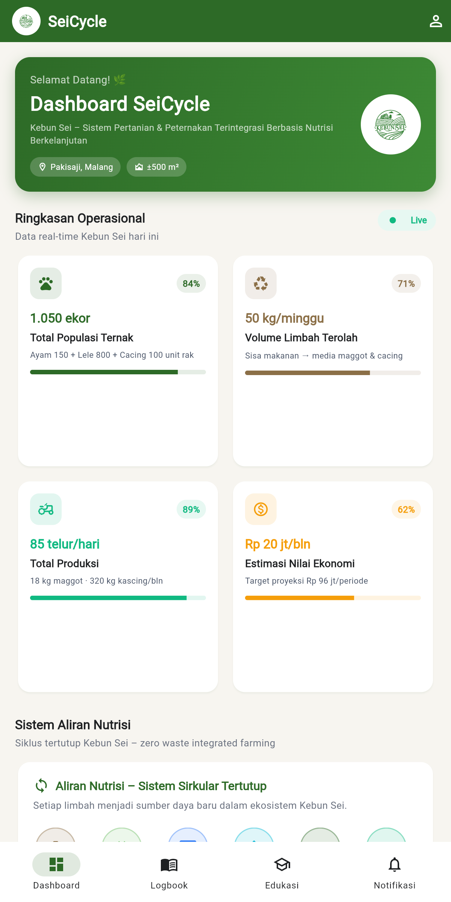
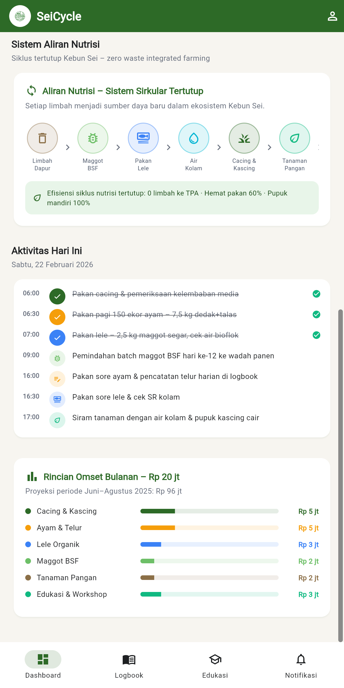
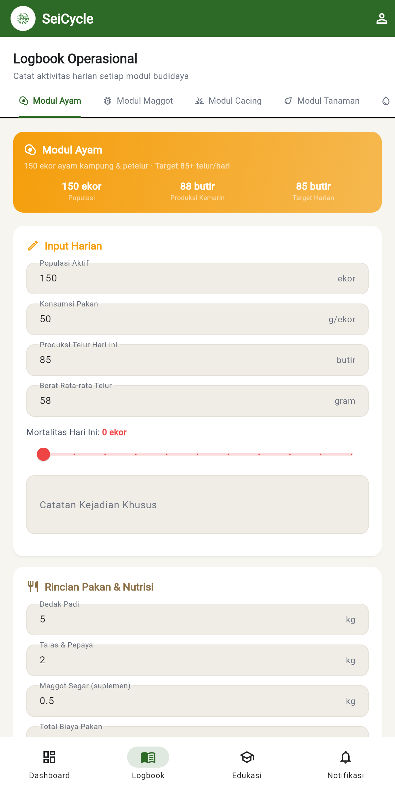
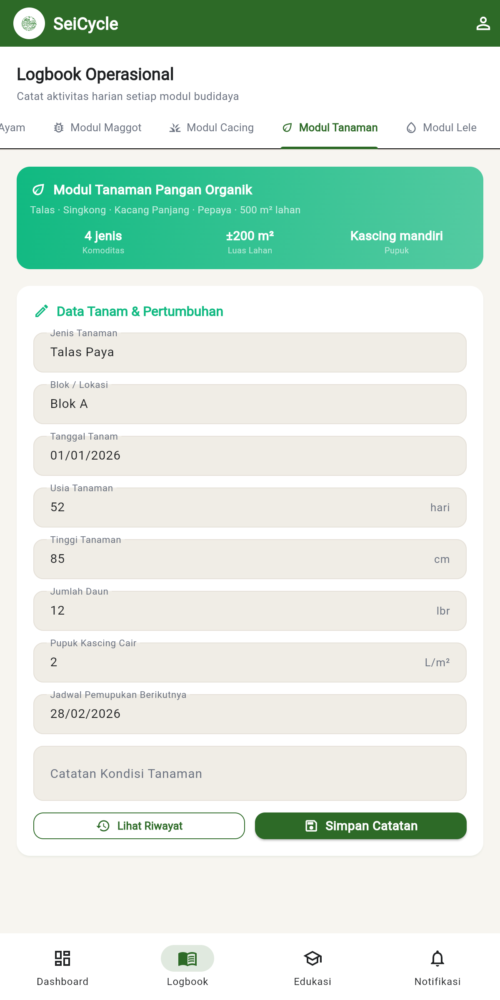
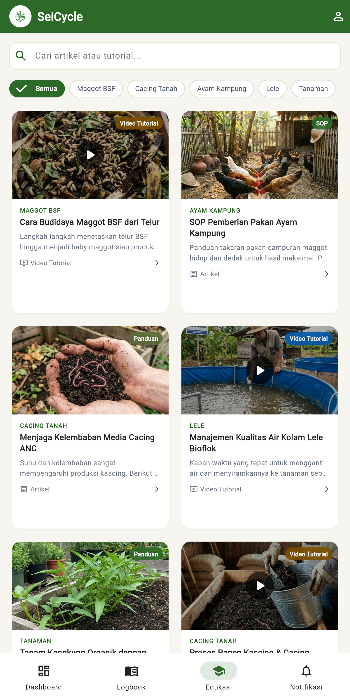
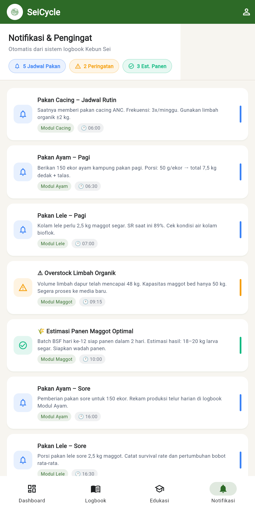

<div align="center">
  
  <h1>SeiCycle</h1>
  <p><strong>Smart Integrated Farming System</strong></p>
  <p>Platform manajemen pertanian-peternakan terintegrasi berbasis siklus nutrisi berkelanjutan untuk <strong>Kebun Sei</strong>, Pakisaji – Malang.</p>

  <p>
    
    
    
    
  </p>
</div>

---

## 🌿 Tentang Proyek

**SeiCycle** adalah aplikasi manajemen pertanian-peternakan berbasis data untuk **Kebun Sei** — ekosistem sirkular tertutup yang mengintegrasikan:

```
Limbah Dapur → Maggot BSF → Pakan Lele → Air Kolam
     ↑                                        ↓
Tanaman Pangan ← Kascing ← Cacing Tanah ←────┘
     ↓
Pakan Ayam → Kotoran Ayam → Media Maggot → (ulang)
```

Zero waste · Efisiensi pakan 60% · Pupuk mandiri 100%

---

## ✨ Fitur Utama (MVP)

### 🏠 Dashboard Terintegrasi

<div align="center">
<table>
  <tr>
    <td align="center">
      
      <br/><sub>Ringkasan Operasional & Quick Stats</sub>
    </td>
    <td align="center">
      
      <br/><sub>Aliran Nutrisi, Aktivitas Harian & Omset</sub>
    </td>
  </tr>
</table>
</div>

- **Hero banner** dengan logo Kebun Sei, lokasi & luas lahan
- **Quick stats grid** responsif: 1.050 ekor ternak · 50 kg limbah/minggu · 85 telur/hari · Rp 20 jt/bln
- **Diagram aliran nutrisi** — closed-loop system visual (Limbah → Maggot → Lele → Cacing → Tanaman)
- **Timeline aktivitas harian** dengan status selesai/belum per jam
- **Rincian omset bulanan** per komoditas dengan progress bar berwarna

---

### 📒 Logbook Operasional (5 Modul)

<div align="center">
<table>
  <tr>
    <td align="center">
      
      <br/><sub>Modul Ayam – Input Harian & Nutrisi</sub>
    </td>
    <td align="center">
      
      <br/><sub>Modul Tanaman – Data Tanam & Pertumbuhan</sub>
    </td>
  </tr>
</table>
</div>

| Modul | Fitur Utama |
|---|---|
| 🐔 **Ayam** | Populasi, konsumsi pakan, produksi telur, mortalitas slider, catatan kesehatan |
| 🐛 **Maggot BSF** | Volume limbah, fase larva slider + badge (Instar/Prepupa/Panen), est. panen |
| 🪱 **Cacing** | Bibit, kelembaban, jadwal pakan, est. kascing |
| 🌿 **Tanaman** | Jenis, blok, tanggal tanam, tinggi/daun, pupuk kascing, jadwal berikutnya |
| 🐟 **Lele** | Tebar benih, survival rate, pakan maggot, pH & suhu kolam |

Form otomatis **2 kolom** di layar lebar, **1 kolom** di mobile. Tombol **Simpan Catatan** & **Lihat Riwayat** di setiap modul.

---

### 📚 Edukasi & Tutorial

<div align="center">
  
</div>

Feed artikel dan video tutorial seputar operasional Kebun Sei:
- 🔍 **Search bar** real-time (filter judul + konten)
- 🏷️ **Filter chips**: Semua · Maggot BSF · Cacing Tanah · Ayam Kampung · Lele · Tanaman
- ▶️ **Video posts** dengan play button overlay di thumbnail
- 🖼️ Thumbnail foto nyata per topik (bukan placeholder)
- 📱 Single-column di mobile · 2-column grid di desktop

---

### 🔔 Notifikasi & Pengingat

<div align="center">
  
</div>

- **5 Jadwal Pakan** — cacing, ayam pagi/sore, lele pagi/sore
- **2 Peringatan** — overstock limbah, kelembaban cacing rendah
- **3 Estimasi Panen Optimal** — maggot, cacing, target telur harian

---

## 📱 Responsive Design

| Layar | Layout |
|---|---|
| **Mobile** `< 768px` | Bottom Navigation Bar (4 tab) + single/double column |
| **Desktop/Web** `≥ 768px` | Side Navigation (240px sidebar) + expanding grid |

---

## 🛠 Tech Stack

| Layer | Teknologi |
|---|---|
| Framework | Flutter 3.x (Dart) |
| State | `StatefulWidget` + `setState` |
| Navigation | `LayoutBuilder` → `NavigationBar` / Custom Sidebar |
| Routing | Tab-based (`DefaultTabController`) |
| Assets | Material Icons + PNG lokal |
| Platform | Android, iOS, Web |

---

## 🎨 Design System

| Token | Nilai |
|---|---|
| Primary Green | `#2D6A27` (dari logo Kebun Sei) |
| Background | `#F7F5F0` — off-white / krem organik |
| Card | `#FFFFFF` + `elevation: 2` |
| Border radius | `16px` |
| Status colors | Success `#10B981` · Warning `#F59E0B` · Info `#3B82F6` |

---

## 🗂 Struktur Proyek

```
lib/
├── main.dart
├── theme/app_theme.dart              # AppColors, ThemeData
├── models/
│   ├── app_data.dart                 # Data dashboard & notifikasi
│   └── edukasi_data.dart             # Data 8 post edukasi
├── screens/
│   ├── dashboard_screen.dart
│   ├── logbook_screen.dart           # 5-modul TabBar
│   ├── edukasi_screen.dart           # Search, filter, feed responsif
│   └── notifikasi_screen.dart
└── widgets/
    ├── common_widgets.dart           # StatCard, NutrientFlowCard, AlertTile
    └── responsive_shell.dart         # 4-tab nav: mobile ↔ desktop
```

---

## 🚀 Cara Menjalankan

```bash
flutter pub get

flutter run -d chrome           # Web browser
flutter run -d web-server \
  --web-hostname=0.0.0.0 \
  --web-port=8080               # Web server (LAN)
flutter run                     # Android / iOS emulator
```

```bash
flutter analyze   # → No issues found ✅
```

---

## 👥 Tim Kebun Sei

| Nama | Peran |
|---|---|
| **Irsal Fauzan Alfarizi** | Founder & Manajer Umum |
| **Fiki Rahmat Dani** | Manajer Keuangan & Strategi Bisnis |
| **Fredi Irawan** | Manajer Pemasaran & Operasional |
| **Raphael Gregory Sosiawan** | Manajer Produksi & Lapangan |
| **Abdulloh Mun'am** | Manajer IT & Digitalisasi |

> Institut Teknologi dan Bisnis Asia Malang — Program P2MW 2025

---

<div align="center">
  <sub>Dibuat dengan ❤️ untuk pertanian berkelanjutan &nbsp;·&nbsp; Kebun Sei © 2025</sub>
</div>
