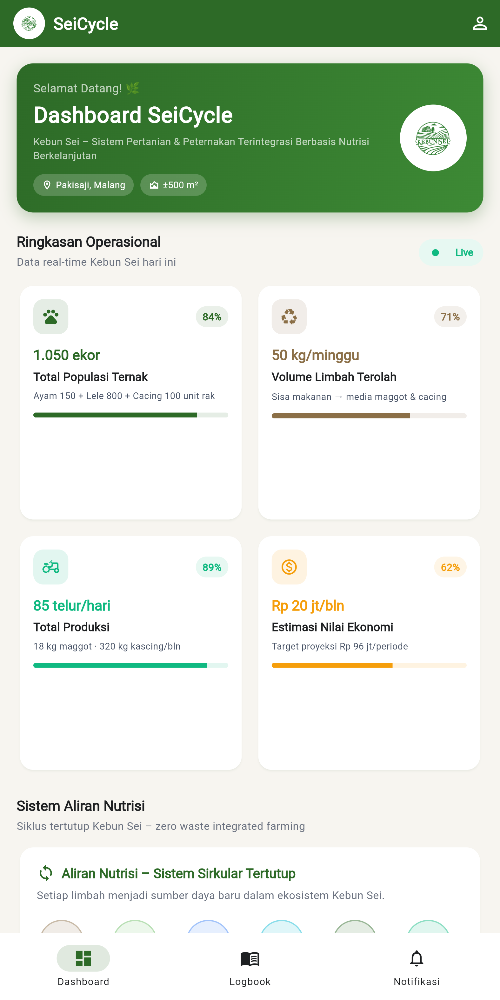
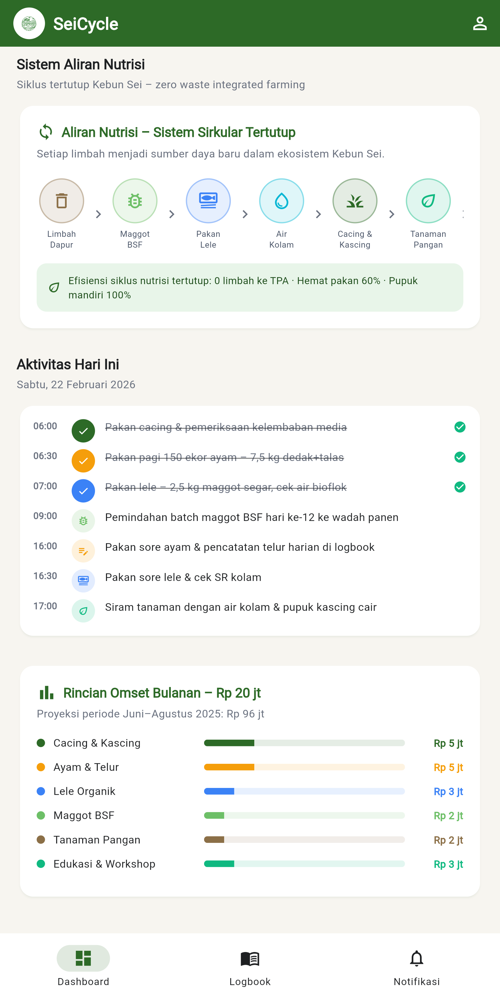
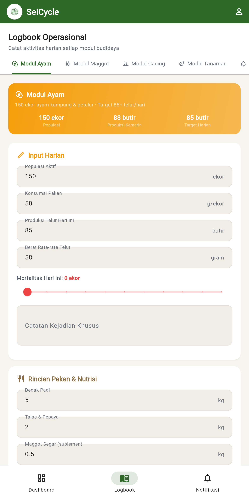
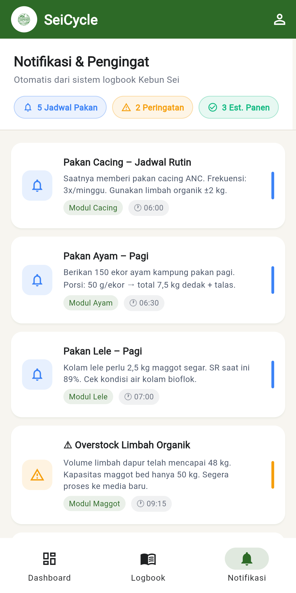

<div align="center">
  
  <h1>SeiCycle</h1>
  <p><strong>Smart Integrated Farming System</strong></p>
  <p>Platform manajemen pertanian-peternakan terintegrasi berbasis siklus nutrisi berkelanjutan untuk <strong>Kebun Sei</strong>, Pakisaji – Malang.</p>

  <p>
    
    
    
    
    
  </p>
</div>

---

## 📸 Screenshots

<table>
  <tr>
    <td align="center">
      
      <br/><sub><b>Dashboard · Ringkasan Operasional</b></sub>
    </td>
    <td align="center">
      
      <br/><sub><b>Dashboard · Aliran Nutrisi & Omset</b></sub>
    </td>
    <td align="center">
      
      <br/><sub><b>Logbook · Modul Ayam (Form)</b></sub>
    </td>
    <td align="center">
      
      <br/><sub><b>Notifikasi & Pengingat Otomatis</b></sub>
    </td>
  </tr>
</table>

---

## 🌿 Tentang Proyek

**SeiCycle** adalah aplikasi manajemen pertanian-peternakan berbasis data yang dirancang untuk **Kebun Sei** — sebuah model ekosistem sirkular tertutup yang mengintegrasikan:

```
Limbah Dapur → Maggot BSF → Pakan Lele → Air Kolam
     ↑                                        ↓
Tanaman Pangan ← Kascing ← Cacing Tanah ←────┘
     ↓
Pakan Ayam → Kotoran Ayam → Media Maggot → (ulang)
```

Sistem ini menjamin **zero waste**, **efisiensi pakan 60%**, dan **pupuk mandiri 100%** hanya dari sumber daya yang ada di kebun.

---

## ✨ Fitur Utama (MVP)

### 🏠 Dashboard Terintegrasi
- **Hero banner** dengan logo Kebun Sei dan info lokasi
- **Quick stats grid** responsif (2 kolom mobile → 4 kolom desktop):
  - Total Populasi Ternak: 1.050 ekor
  - Volume Limbah Terolah: 50 kg/minggu
  - Total Produksi: 85 telur/hari + 18 kg maggot + 320 kg kascing/bln
  - Estimasi Nilai Ekonomi: Rp 20 jt/bulan
- **Diagram aliran nutrisi** — closed-loop system visual
- **Timeline aktivitas harian** dengan status selesai/belum
- **Rincian omset bulanan** per komoditas

### 📒 Logbook Operasional (5 Modul)
| Modul | Fitur Utama |
|---|---|
| 🐔 **Ayam** | Populasi, konsumsi pakan, produksi telur, mortalitas slider, catatan kesehatan |
| 🐛 **Maggot BSF** | Volume limbah, fase larva slider + badge (Instar/Prepupa/Panen), est. panen |
| 🪱 **Cacing** | Bibit, kelembaban, jadwal pakan, est. kascing |
| 🌿 **Tanaman** | Jenis, tanggal tanam, tinggi/daun, jadwal pemupukan |
| 🐟 **Lele** | Tebar benih, survival rate, pakan maggot, pH & suhu kolam, bobot rata-rata |

Form otomatis **2 kolom** di layar lebar, **1 kolom** di mobile.

### 🔔 Notifikasi & Pengingat
- **5 Jadwal Pakan** (cacing, ayam pagi/sore, lele pagi/sore)
- **2 Peringatan** (overstock limbah, kelembaban cacing rendah)
- **3 Estimasi Panen Optimal** (maggot, cacing, target telur)

---

## 📱 Responsive Design

| Layar | Layout |
|---|---|
| **Mobile** `< 768px` | Bottom Navigation Bar + single/double column |
| **Desktop/Web** `≥ 768px` | Side Navigation (240px sidebar) + expanding grid |

---

## 🛠 Tech Stack

| Layer | Teknologi |
|---|---|
| Framework | Flutter 3.x (Dart) |
| State | `StatefulWidget` + `setState` |
| Navigation | `LayoutBuilder` → `NavigationBar` / Custom Sidebar |
| Routing | Tab-based (`DefaultTabController`) |
| Assets | Material Icons + logo PNG lokal |
| Platform | Android, iOS, Web (Flutter Web) |

---

## 🎨 Design System

| Token | Nilai |
|---|---|
| Primary Green | `#2D6A27` (dari logo Kebun Sei) |
| Background | `#F7F5F0` — off-white / krem organik |
| Card | `#FFFFFF` + `elevation: 2` |
| Border radius | `16px` (mencerminkan sistem sirkular) |
| Typography | Material `TextTheme` — clean sans-serif |
| Status colors | Success `#10B981` · Warning `#F59E0B` · Info `#3B82F6` |

---

## 🗂 Struktur Proyek

```
lib/
├── main.dart                       # Entry point – SeiCycleApp
├── theme/
│   └── app_theme.dart              # AppColors, AppTheme.lightTheme
├── models/
│   └── app_data.dart               # Static dummy data (dari dokumen bisnis)
├── screens/
│   ├── dashboard_screen.dart       # Dashboard dengan stats, flow, timeline, omset
│   ├── logbook_screen.dart         # 5-modul TabBar + form lengkap Ayam & Maggot
│   └── notifikasi_screen.dart      # Alert list dengan tipe info/warning/success
└── widgets/
    ├── common_widgets.dart         # StatCard, NutrientFlowCard, AlertTile, SectionHeader
    └── responsive_shell.dart       # Layout switch mobile ↔ desktop di 768px
```

---

## 🚀 Cara Menjalankan

### Prasyarat
- Flutter SDK `≥ 3.10.x` — [instalasi](https://docs.flutter.dev/get-started/install)
- Dart SDK `≥ 3.x`
- Device: Android emulator / iOS simulator / Chrome / Linux desktop

### Langkah
```bash
# 1. Clone / masuk ke direktori project
cd sei_cycle

# 2. Install dependencies
flutter pub get

# 3. Jalankan di browser (Web)
flutter run -d chrome

# 4. Jalankan di web server (akses dari LAN)
flutter run -d web-server --web-hostname=0.0.0.0 --web-port=8080

# 5. Jalankan di Android / iOS emulator
flutter run

# 6. Build web production
flutter build web
```

### Analisis Kode
```bash
flutter analyze     # Static analysis – seharusnya: No issues found
flutter test        # Unit / widget tests
```

---

## 📊 Data Dummy (dari Dokumen Bisnis)

Data yang ditampilkan di app diambil dari dokumen rencana bisnis aktual Kebun Sei:

| Komoditas | Data |
|---|---|
| Ayam kampung & petelur | 150 ekor, target 85 telur/hari, pakan 50 g/ekor |
| Lele (kolam bioflok) | 800 ekor tebar, SR 89%, pakan 5 kg maggot/hari |
| Maggot BSF | Siklus 14 hari, estimasi panen 18–20 kg/batch, 5 rak aktif |
| Cacing ANC | 10 kg bibit, kelembaban 70%, pakan 3×/minggu |
| Omset bulanan | Rp 20 jt/bulan (proyeksi Rp 96 jt/periode Jun–Ags 2026) |

---

## 👥 Tim Kebun Sei

| Nama | Peran |
|---|---|
| **Irsal Fauzan Alfarizi** | Founder & Manajer Umum |

> Institut Teknologi dan Bisnis Asia Malang — Program P2MW 2026

---

## 📄 Lisensi

Proyek ini bersifat privat dan dikembangkan untuk keperluan internal **Kebun Sei** dalam rangka Program Pembinaan Mahasiswa Wirausaha (P2MW) 2026.

---

<div align="center">
  <sub>Dibuat dengan ❤️ untuk pertanian berkelanjutan &nbsp;·&nbsp; Kebun Sei © 2026</sub>
</div>
