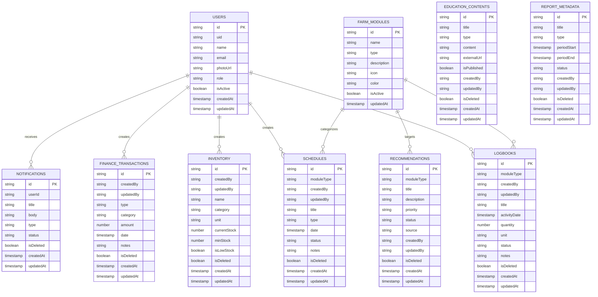

# ERD MVP SeiCycle

Firestore bersifat document database, sehingga diagram berikut menunjukkan relasi logis melalui UID dan `moduleType`, bukan foreign key database.

AI otomatis, laporan file besar, Storage upload, Cloud Functions, dan backend API berada di luar scope MVP ini.
