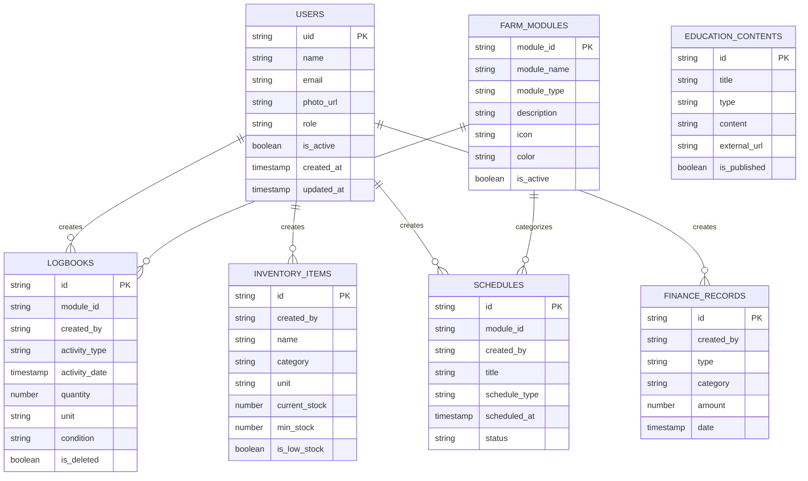

# ERD MVP SeiCycle

Firestore bersifat document database, sehingga diagram berikut menunjukkan
relasi logis melalui UID dan `module_id`, bukan foreign key database.

AI recommendation, laporan PDF/Excel, Storage upload, dan backend API berada di
luar scope MVP.
